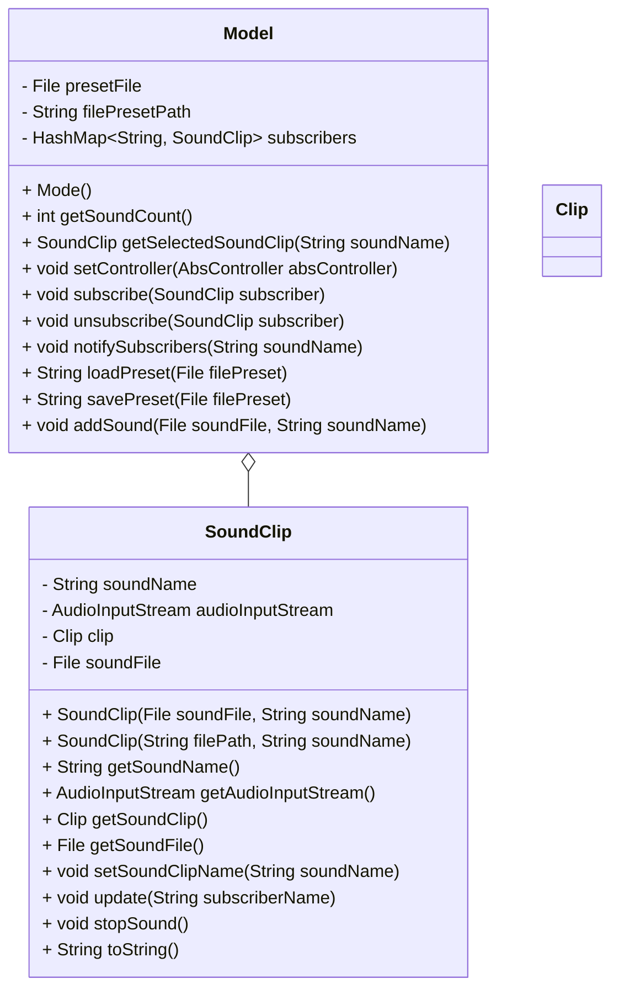

**Table of Conetents**

- [Introduction](#introduction)
- [Build Guide](#build-guide)
- [Design](#design)

# Introduction

This document contains most of the important information related to JSoundBoard including how to build the application, the design, and development conventions.

# Build Guide

To build the application, run the following in the `/src` directory:

```bash
javac org/jsoundboard/main/JSoundBoard.java -d ../classes
```

Next, go to the `/classes` directory, make sure a `manifest.txt` file is there, and run the following:

```bash
jar -cvmf ../manifest.txt ../jsoundboard.jar org/
```

*Note:* You don't have to use the path above for the final destination for the jar file. You can put it where ever you feel is good.

To run the application, go to where the jar file is and run:

```bash
java -jar jsoundboard.jar
```

# Design

The application uses the Model-View-Controller (MVC) architecture. The reason for this is to make it clear what code is responsible for. Below is a more detailed explanation of these responsibilities.

## MVC Architecture 

Below is a UML diagram of the Model, View, and Controller classes.

Each has the following responsibilities:

- Model is responsible for handling data and playing sounds.
- View is responsible for display the GUI and allowing the user to play the sounds.
- Controller is responsible for communications between the Model and View, and handling errors when they happen in either the Model or View.

## Model



- The Model and SoundClip use the observer design pattern.
	- The rationale for this pattern is to make it easy to play the correct sound when the user clicks the button corresponding to that sound.
- The SoundClip class is responsible for actually loading the sound file and playing it.
