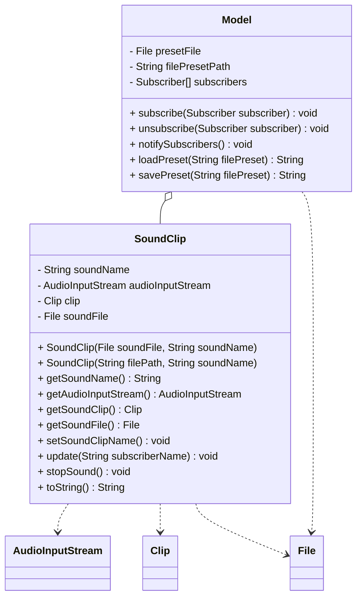
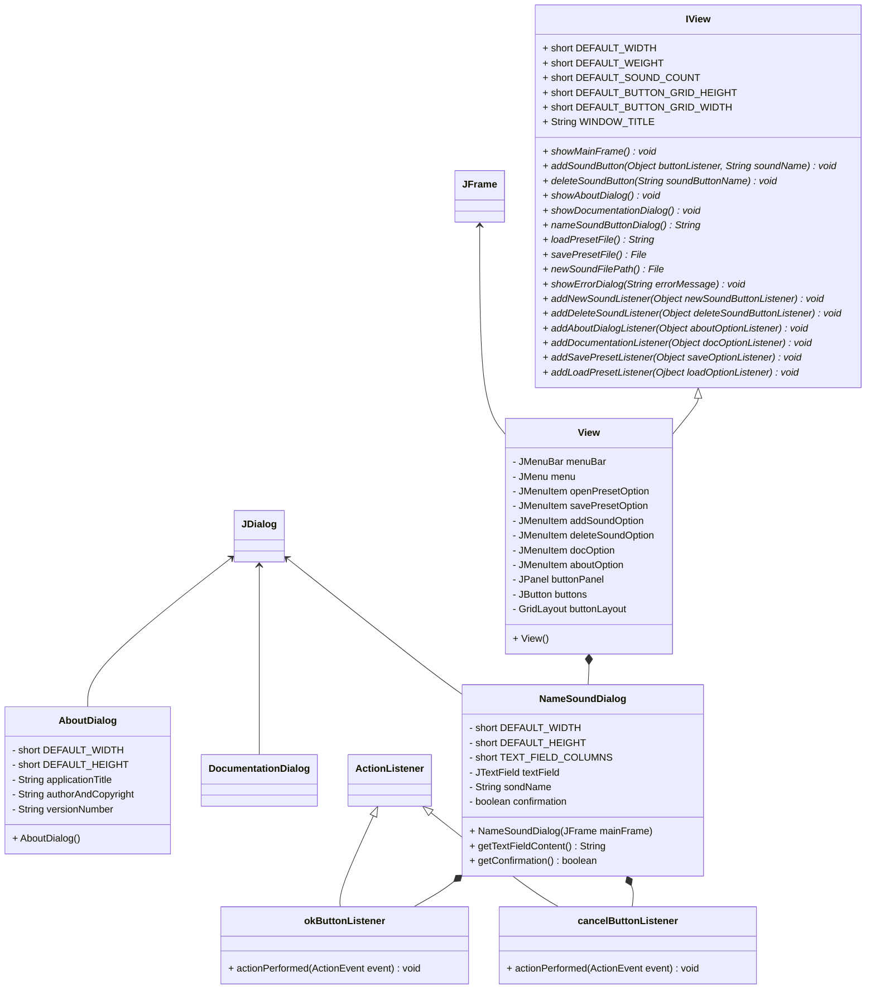
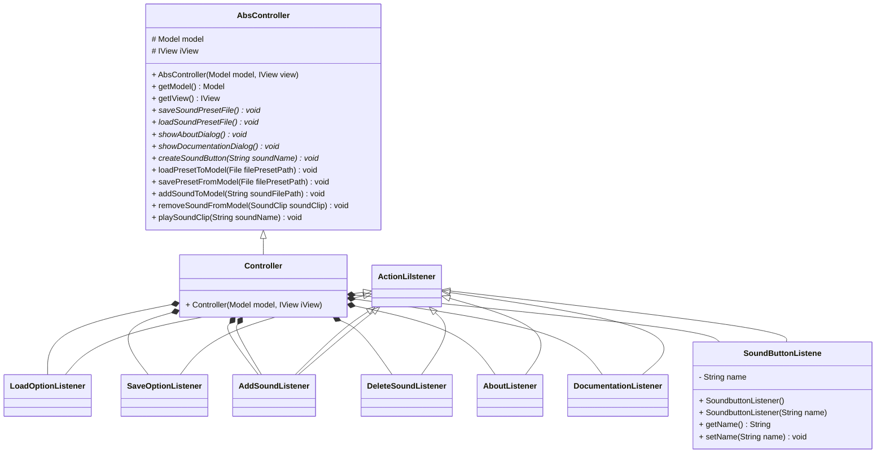

**Table of Conetents**

- [Introduction](#introduction)
- [Build Guide](#build-guide)
- [Design](#design)
	- [MVC Architecture ](#mvc-architecture )
		- [Model](#model)
		- [View](#view)
		- [Controller](#controller)
- [Contributing Guidelines](#contributing-guidelines)

- - -

# Introduction

This document contains most of the important information related to JSoundBoard including how to build the application, the design, and development conventions.

# Build Guide

To build the application, run the following in the `/src` directory:

```bash
javac org/jsoundboard/main/JSoundBoard.java -d ../classes
```

Next, go to the `/classes` directory, make sure a `manifest.txt` file is there, and run the following:

```bash
jar -cvmf ../manifest.txt ../jsoundboard.jar org/
```

*Note:* You don't have to use the path above for the final destination for the jar file. You can put it where ever you feel is good.

To run the application, go to where the jar file is and run:

```bash
java -jar jsoundboard.jar
```

You can also skip putting the application in a `.jar` file by just compiling it and running it in the `/classes` directory by doing the following

```bash
java org/jsoundboard/main/JSoundBoard
```

This is good for when you want to constantly check on your work.

# Design

The application uses the Model-View-Controller (MVC) architecture. The reason for this is to make it clear what code is responsible for. Below is a more detailed explanation of these responsibilities.

## MVC Architecture 

Below is a UML diagram of the Model, View, and Controller classes.

Each has the following responsibilities:

- Model is responsible for handling data and playing sounds.
- View is responsible for display the GUI and allowing the user to play the sounds.
- Controller is responsible for communications between the Model and View, and handling errors when they happen in either the Model or View.

### Model


```mermaid
classDiagram

class Model {
	- File presetFile
	- String filePresetPath
	- Subscriber[] subscribers
	+ subscribe(Subscriber subscriber) void
	+ unsubscribe(Subscriber subscriber) void
	+ notifySubscribers() void
	+ loadPreset(String filePreset) String
	+ savePreset(String filePreset) String
}
class SoundClip {
	- String soundName
	- AudioInputStream audioInputStream
	- Clip clip
	- File soundFile
	+ SoundClip(File soundFile, String soundName)
	+ SoundClip(String filePath, String soundName)
	+ getSoundName() String
	+ getAudioInputStream() AudioInputStream
	+ getSoundClip() Clip
	+ getSoundFile() File
	+ setSoundClipName() void
	+ update(String subscriberName) void
	+ stopSound() void
	+ toString() String
}

Model o-- SoundClip
Model ..> File
SoundClip ..> AudioInputStream
SoundClip ..> Clip
SoundClip ..> File
```

- The Model and SoundClip use the observer design pattern.
	- The rationale for this pattern is to make it easy to play the correct sound when the user clicks the button corresponding to that sound.
- The SoundClip class is responsible for actually loading the sound file and playing it.
	- It is composed with the following classes that come from the Java standard library: `AudioInputStream`, `Clip`, and `File`.
		- See the Java API documentation for further details about these classes.

### View


```mermaid
classDiagram

class IView {
	+ short DEFAULT_WIDTH
	+ short DEFAULT_WEIGHT
	+ short DEFAULT_SOUND_COUNT
	+ short DEFAULT_BUTTON_GRID_HEIGHT
	+ short DEFAULT_BUTTON_GRID_WIDTH
	+ String WINDOW_TITLE
	+ showMainFrame() void*
	+ addSoundButton(Object buttonListener, String soundName) void*
	+ deleteSoundButton(String soundButtonName) void*
	+ showAboutDialog() void*
	+ showDocumentationDialog() void*
	+ nameSoundButtonDialog() String*
	+ loadPresetFile() String*
	+ savePresetFile() File*
	+ newSoundFilePath() File*
	+ showErrorDialog(String errorMessage) void*
	+ addNewSoundListener(Object newSoundButtonListener) void*
	+ addDeleteSoundListener(Object deleteSoundButtonListener) void*
	+ addAboutDialogListener(Object aboutOptionListener) void*
	+ addDocumentationListener(Object docOptionListener) void*
	+ addSavePresetListener(Object saveOptionListener) void*
	+ addLoadPresetListener(Ojbect loadOptionListener) void*
}
class View {
	- JMenuBar menuBar
	- JMenu menu
	- JMenuItem openPresetOption
	- JMenuItem savePresetOption
	- JMenuItem addSoundOption
	- JMenuItem deleteSoundOption
	- JMenuItem docOption
	- JMenuItem aboutOption
	- JPanel buttonPanel
	- JButton buttons
	- GridLayout buttonLayout
	+ View()
}
class AboutDialog {
	- short DEFAULT_WIDTH
	- short DEFAULT_HEIGHT
	- String applicationTitle
	- String authorAndCopyright
	- String versionNumber
	+ AboutDialog()
}
class DocumentationDialog
class NameSoundDialog {
	- short DEFAULT_WIDTH
	- short DEFAULT_HEIGHT
	- short TEXT_FIELD_COLUMNS
	- JTextField textField
	- String sondName
	- boolean confirmation
	+ NameSoundDialog(JFrame mainFrame)
	+ getTextFieldContent() String
	+ getConfirmation() boolean
}
class okButtonListener {
	+ actionPerformed(ActionEvent event) void
}
class cancelButtonListener {
	+ actionPerformed(ActionEvent event) void
}

IView <|-- View
JFrame <-- View
View *-- NameSoundDialog
JDialog <-- AboutDialog
JDialog <-- DocumentationDialog
JDialog <-- NameSoundDialog
NameSoundDialog *-- okButtonListener
NameSoundDialog *-- cancelButtonListener
ActionListener <| -- okButtonListener
ActionListener <| -- cancelButtonListener
```

- The View is split between two classes: `IView` and `View`.
	- The reason for this is to allow someone to change the interface if they want to, or to use a completely different GUI library altogether.
		- Hence, why `IView` class exists--it serves as a *contract* that must be fulfilled if someone decides to do that.
- The `View`, `NameSoundDialog`, `DocumentationDialog`, and `AboutDialog` inherit from Java Swing classes, hence why there is some sparseness in the diagram.
	- Look at the Java API documentation for further details on those classes.

*Note:* The UML class diagram is made using Mermaid, but it does not let the user decide where each part of the diagram goes. So, if it looks bad, that's why.

### Controller


```mermaid
classDiagram
class AbsController {
	# Model model
	# IView iView
	+ AbsController(Model model, IView view)
	+ getModel() Model
	+ getIView() IView
	+ saveSoundPresetFile() void*
	+ loadSoundPresetFile() void*
	+ showAboutDialog() void*
	+ showDocumentationDialog() void*
	+ createSoundButton(String soundName) void*
	+ loadPresetToModel(File filePresetPath) void
	+ savePresetFromModel(File filePresetPath) void
	+ addSoundToModel(String soundFilePath) void
	+ removeSoundFromModel(SoundClip soundClip) void
	+ playSoundClip(String soundName) void
}
class Controller {
	+ Controller(Model model, IView iView)
}
class LoadOptionListener
class SaveOptionListener
class AddSoundListener
class AddSoundListener
class DeleteSoundListener
class AboutListener
class DocumentationListener
class SoundButtonListene {
	- String name
	+ SoundbuttonListener()
	+ SoundbuttonListener(String name)
	+ getName() String
	+ setName(String name) void
}

AbsController <|-- Controller

Controller *-- LoadOptionListener
Controller *-- SaveOptionListener
Controller *-- AddSoundListener
Controller *-- AddSoundListener
Controller *-- DeleteSoundListener
Controller *-- AboutListener
Controller *-- DocumentationListener
Controller *-- SoundButtonListene

ActionLilstener <|-- LoadOptionListener
ActionLilstener <|-- SaveOptionListener
ActionLilstener <|-- AddSoundListener
ActionLilstener <|-- AddSoundListener
ActionLilstener <|-- DeleteSoundListener
ActionLilstener <|-- AboutListener
ActionLilstener <|-- DocumentationListener
ActionLilstener <|-- SoundButtonListene
```

- the `Controller` class inherits from the and abstract `AbsController` class. The reason for this is when the user decides to use different libraries to customize the application, they have a contract they know they need to fulfill in order for the application to work.
	- Another reason for using an abstract class and not an interface is because there are some methods that are already implemented that a user doesn't need to customize.
	- The abstract methods are the only things the user has to fulfill.
- The listeners don't really have much in them because `ActionListener` is an interface with one method they need to implement.
	- the exception is `SoundButtonListener`, and that's because that object will last as long as that sound is used in the application.

# Contributing Guidelines

When you contribute code, be sure to describe what you did as clearly as you can. Also, you must follow this procedure:

- If you are tackling an issue, generate a branch from that issue's page and assign yourself to the issue.
	- Assigning yourself to the issue helps to keep track who is doing what.
- When you feel you are finished, be sure to use the keywords `closes`, `resolves`, or `fixes` follow by a pound sign with the issue number (i.e. `#42`).
	- This will automatically close the issue once a pull request has been completed.
		- **Ex:** `This commit closes #42 <add more description to your commit>.`
	- **DO NOT MERGE INTO MAIN.**
	- Push your branch to the remote repo.
- On GitHub, make a pull request to merge the branch that contains your work.
	- This gives a chance for someone to check your work and test it before merging it to the main branch.
